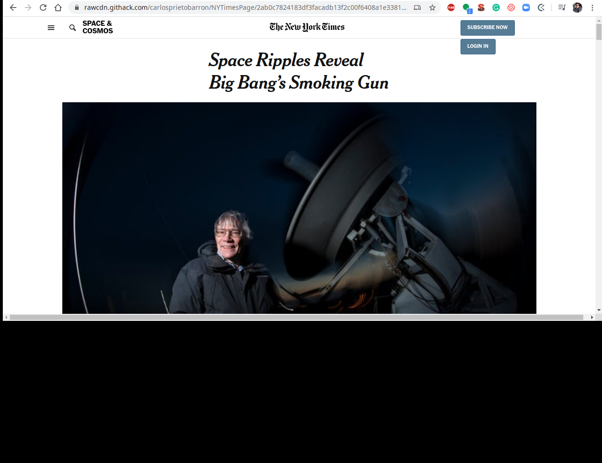

# New York Times Article Page Clone

In this project, your assignment is to copy this article from the New York Times(open in an “incognito” window without cookies to view it if you’re over your monthly limit). Notice how the section titled “The Theory of Inflation” (you may need to widen your viewing window for it to show up) is laid out.

You can use any or all of the positioning techniques you’ve learned in this section. The modern way would be to use Flexbox or Grid. There are certain times where FlexBox and Grid can’t achieve the layout you want, knowing floats and other positioning techniques is valuable practice and you should try and use a combination of techniques for this project.

## Built With

- HTML
- fontawesome
- CSS
- Floats and Positioning

## Live Demo

[Live Demo Link](https://rawcdn.githack.com/carlosprietobarron/NYTimesPage/2ab0c7824183df3facadb13f2c00f6408a1e3381/index.html)

## Authors

👤 Carlos Prieto Barron

- Github: [@carlosprietobarron](https://github.com/carlosprietobarron)

👤 **Ruben Paz Chuspe**

- Github: [@rubenpazch](https://github.com/rubenpazch)
- Linkedin: [rubenpch](https://www.linkedin.com/in/rubenpch/)

## 🤝 Contributing

Contributions, issues and feature requests are welcome!

Feel free to check the [issues page](issues/).

## Show your support

Give a ⭐️ if you like this project!

## Acknowledgments

- Hat tip to anyone whose code was used
- Inspiration
- etc

## 📝 License

This project is [MIT](lic.url) licensed.
